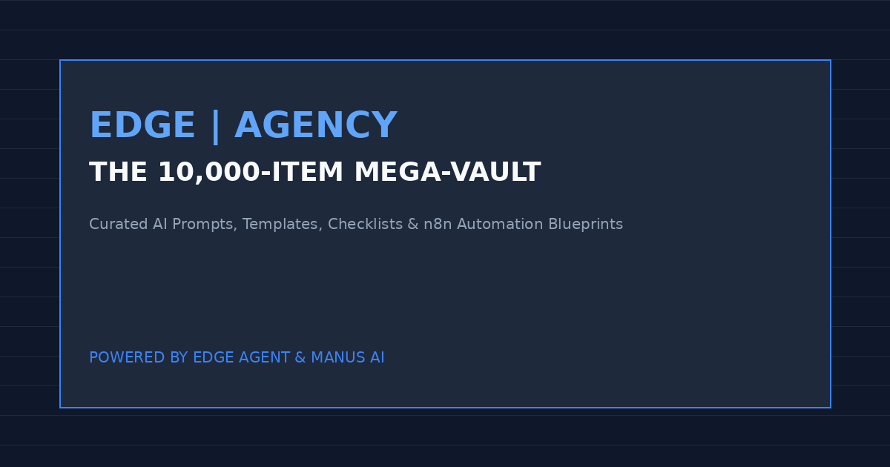

# 🏛️ THE 10,000-ITEM MEGA-VAULT

> "The 10,000-item mega-vault represents the pinnacle of structured AI prompt engineering, automation blueprints, business frameworks, and niche startup systems. Designed for advanced operators, agency founders, and enterprise architects."
> — **EDGE | AGENCY** [1]

## Overview & Architecture

The mega-vault is structured into eight core categories containing over 10,000 meticulously curated items. Each category is engineered to provide immediate plug-and-play utility across modern AI platforms including Claude, ChatGPT, Gemini, and enterprise automation engines like n8n and Make.com [2].

| Category ID | Vault Category Name | Total Items | Primary Focus | Vault Link |
| :--- | :--- | :--- | :--- | :--- |
| **CAT-01** | Prompt Libraries | 2,000+ | Profession-specific workflows, marketing, sales, & finance prompts | [Explore](./vault/01-prompt-libraries/) |
| **CAT-02** | Templates | 1,500+ | Business plans, Claude XML schemas, & n8n workflows | [Explore](./vault/02-templates/) |
| **CAT-03** | Niche Startup Checklists | 1,000+ | 67 industry startup execution frameworks & compliance guides | [Explore](./vault/03-niche-startup-checklists/) |
| **CAT-04** | Frameworks | 1,000+ | Claude Agent architectures, business growth, & reasoning models | [Explore](./vault/04-frameworks/) |
| **CAT-05** | Code Templates | 1,000+ | Python, TypeScript, API routers, & automation snippets | [Explore](./vault/05-code-templates/) |
| **CAT-06** | Automation Blueprints | 1,000+ | AI-powered CRM, SEO engines, & operations pipelines | [Explore](./vault/06-automation-blueprints/) |
| **CAT-07** | Niche Packs | 1,000+ | End-to-end vertical kits across 67 specific industries | [Explore](./vault/07-niche-packs/) |
| **CAT-08** | Master Prompt Vault | 1,500+ | Universal, Claude-optimized, and specialized niche prompts | [Explore](./vault/08-master-prompt-vault/) |

---

## Detailed Category Breakdown

### 1. Prompt Libraries (2,000+ items)
Covers 67 distinct professions (real estate, roofing, HVAC, legal, medical, SaaS founders, e-commerce, agencies, etc.) with 30 prompts per profession across workflow, marketing, sales, operations, finance, and growth.

### 2. Templates (1,500+ items)
- **Business Templates (300+)**: Business plans, pitch decks, SWOTs, competitor analysis, pricing models, brand identity, customer avatars, funnels, SOPs, hiring templates, KPI dashboards.
- **AI Templates (400+)**: Claude XML templates, agent templates, tool schemas, chain-of-thought structures, research and coding templates.
- **Automation Templates (800+)**: n8n, Zapier, and Make.com workflows, CRM automations, lead qualification, onboarding, customer support, and SEO automations.

### 3. Niche Startup Checklists (1,000+ items)
Covers 67 niches with 15 granular checklist items per niche (licensing, equipment, branding, CRM, marketing, sales, operations, finance, automation, KPIs, hiring, compliance, tools, and launch plans).

### 4. Frameworks (1,000+ items)
- **Claude Agent Frameworks (200+)**: Research, coding, SEO, competitor analysis, onboarding, CRM, customer support, and automation agents.
- **Business Frameworks (300+)**: Growth, pricing, branding, marketing, sales, operations, and leadership frameworks.
- **AI Frameworks (500+)**: Prompt frameworks, reasoning models, chain-of-thought structures, tool-use protocols, and agent orchestration.

### 5. Code Templates (1,000+ items)
- **Claude API Templates (300+)**: Python, TypeScript, Node.js, Go, serverless multi-tool agents, and structured output templates.
- **Automation Code (400+)**: n8n custom nodes, webhook handlers, API routers, CRM integrations, and booking systems.
- **Business Code (300+)**: Pricing calculators, KPI dashboards, CRM scripts, and analytics tools.
- **Gumroad Integration**: Automated sales tracking, subscriber management, and license verification logic.

### 6. Automation Blueprints (1,000+ items)
- **AI-Powered Systems (500+)**: AI CRM, AI onboarding, AI support, AI content engine, AI SEO engine, lead generation engine, appointment booking engine.
- **Business Systems (500+)**: Sales systems, marketing systems, operations pipelines, and HR workflows.

### 7. Niche Packs (1,000+ items)
67 niche packs containing prompts, templates, checklists, frameworks, systems, tools, marketing assets, and Claude agent prompts tailored for each industry.

### 8. Master Prompt Vault (1,500+ items)
- **Universal Prompts (500+)**: Writing, analysis, coding, research, creative, and business tasks.
- **Claude-Optimized (500+)**: XML structured prompts, tool definitions, and agent workflows.
- **Niche Prompts (500+)**: Industry-specific prompt collections.

---

## References

[1] EDGE | AGENCY. *The 10,000-Item Mega-Vault Architecture Guide*. 2026.  
[2] Anthropic. *Claude System Prompts and XML Engineering Standards*. 2025.

---
*Powered by EDGE | AGENCY & Manus AI*
