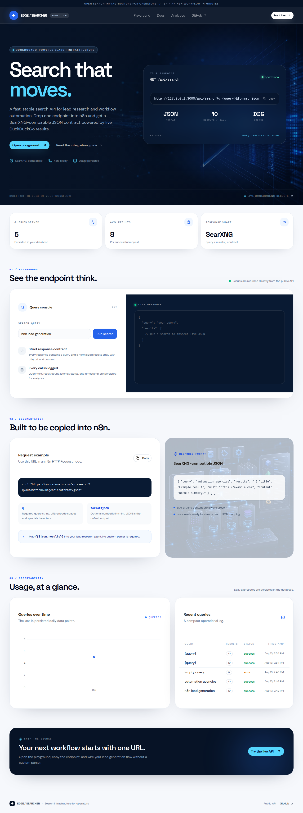

<div align="center">
  

  # EDGE / SEARCHER

  **Search infrastructure for operators.**

  A DuckDuckGo-powered, SearXNG-compatible search API for n8n lead generation workflows.

  [](https://github.com/EdgeAgent/n8n-automations)
  [](https://n8n.io)
  [](https://docs.searxng.org/dev/search_api.html)
  [](LICENSE)
</div>

<br />

> **One endpoint. Zero parser drama.** Wire live search into an n8n HTTP Request node and keep your downstream workflow focused on qualification, enrichment, and action.

## 🚀 Enterprise Deployment & Mega-Vault

For step-by-step instructions on deploying the n8n automation pipelines included in this repository, please review the **[Enterprise Deployment Guide](./DEPLOYMENT_GUIDE.md)** [1].

## 🏛️ The 10,000-Item Mega-Vault

This repository now features **The 10,000-Item Mega-Vault**, a massive, structured, niche-spanning resource library containing prompt libraries, business templates, niche startup checklists, Claude agent frameworks, code templates, automation blueprints, and niche packs [1]. 

👉 **[Explore the Mega-Vault Master Index](./MEGA_VAULT.md)**

---

## Why this repo exists

Most lead-generation automations lose time at the boundary between search and orchestration. Providers return different shapes, nodes change names, and every new workflow grows another custom parser. EDGE / SEARCHER gives the workflow a stable contract: a `query` string and a `results[]` array where every result contains `title`, `url`, and `content`.

The repository pairs the public search service with a curated collection of n8n workflow patterns, including lead qualification, scraping, enrichment, support automation, and social publishing. The visual language is intentionally sharp: **electric blue signal, dark operator console, direct documentation, and no decorative noise.**

## The signal, at a glance

<div align="center">
  
</div>

| Capability | What you get |
| --- | --- |
| **Search API** | `GET /api/search?q={query}&format=json` backed by live DuckDuckGo results |
| **Stable output** | SearXNG-compatible JSON with `query` plus normalized `results[]` |
| **n8n fit** | Copy the endpoint into an HTTP Request node; map `$json.results` downstream |
| **Observability** | Query history, result counts, status, latency, and daily aggregates persisted in the database |
| **Operator UI** | Live playground, request examples, response viewer, and usage analytics |

## Visual system

<div align="center">
  
</div>

The interface is built around a high-contrast operator palette: deep navy for focus, electric blue for action, and a luminous cyan accent for live signal. The generated visuals are original assets created for this repository and are used as product storytelling surfaces rather than stock decoration.

## Quick start with n8n

1. Add an **HTTP Request** node.
2. Set the method to `GET`.
3. Use the endpoint below, replacing `{query}` with an n8n expression or URL-encoded search phrase.
4. Set the response format to JSON.
5. Map `{{$json.results}}` into your qualification or enrichment step.

```bash
curl "https://your-domain.com/api/search?q=automation%20agencies&format=json"
```

### Request

```text
GET /api/search?q={query}&format=json
```

| Parameter | Required | Description |
| --- | --- | --- |
| `q` | Yes | Search query string. Spaces and special characters should be URL-encoded. |
| `format` | No | Compatibility hint. `json` is the expected response format and the default output. |

### Response contract

```json
{
  "query": "automation agencies",
  "results": [
    {
      "title": "Example result",
      "url": "https://example.com",
      "content": "Result summary..."
    }
  ]
}
```

The contract is deliberately small. That makes it easy to pass into an AI agent, a qualification chain, a spreadsheet write, or a CRM enrichment step without a translation layer.

## Repository map

```text
.
├── ai_powered_lead_qualification/   # Agent-led qualification workflow
├── web_scraper_to_google_sheet/     # Scrape and persist structured leads
├── real_estate_investor_engine/     # Python research engine
├── gumroad_integration/             # Gumroad sales & subscriber sync
├── assets/                          # Original project visuals
├── create_markdown_files.py         # Workflow documentation helper
└── README.md
```

Every workflow directory includes an importable `.json` export and a readable `.md` guide. Import the JSON into n8n, then follow the local documentation for credentials, field mapping, and idempotency notes.

## Run the dashboard locally

The permanent dashboard lives in the companion `agency-lead-search` web project. It exposes the API route, the live playground, and database-backed analytics.

```bash
pnpm install
pnpm dev
```

Open the local URL printed by the dev server and use the playground to test a live query. The application also includes a production build and Vitest coverage for the search parser, REST endpoint, and persistence helpers.

## Reliability notes

The API normalizes upstream search output before returning it. Empty queries produce a compatible empty payload with a `400` status, while upstream failures produce the same SearXNG-shaped response with a `502` status. Search executions are recorded with query text, result count, duration, status, and timestamp so operators can inspect behavior instead of guessing.

Do not commit API secrets or provider credentials. Store them in the deployment environment or n8n credentials manager, and keep exported workflows free of live tokens.

## Contributing

Contributions are welcome when they make the workflows easier to import, safer to operate, or more useful in a real agency pipeline. Keep workflow exports paired with human-readable documentation, avoid hardcoded secrets, and prefer idempotent writes for every external side effect.

## References

[1] EDGE | AGENCY. *The 10,000-Item Mega-Vault Architecture Guide*. 2026.

## License

MIT. Use the workflows as a starting point, adapt them to your stack, and keep the operator experience sharp.

<div align="center">
  <br />
  <strong>EDGE / SEARCHER</strong><br />
  <sub>Make the signal useful.</sub>
</div>
