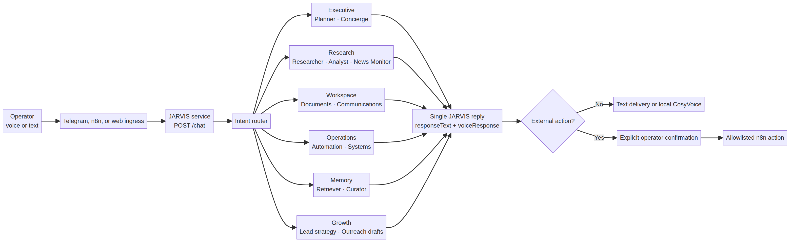

<div align="center">
  

  # JARVIS

  **One assistant identity. Bounded department intelligence. Local-first voice.**

  [](https://www.python.org/)
  [](https://fastapi.tiangolo.com/)
  [](https://n8n.io/)
  [](https://github.com/FunAudioLLM/CosyVoice)
  [](../LICENSE)
</div>

<br />

> **JARVIS is the assistant you talk to.** Executive, Research, Workspace, Operations, Memory, and Growth managers work behind the scenes, then return one direct, safe answer.

## Why it exists

Most multi-agent projects make the operator manage a collection of bots. JARVIS keeps the experience coherent: it routes an intent to one relevant department, bounds the resulting work, and synthesizes a single answer. External actions are proposed with risk metadata and wait for explicit approval rather than being executed by model output.

| Operator need | JARVIS behavior |
| --- | --- |
| Plan, draft, or reason through a request | Routes to the right manager and responds in one voice. |
| Research, retrieve memory, or use a connected system | States the tool requirement and never fabricates access. |
| Send a message, update a CRM, start a workflow, or overwrite a file | Returns a reviewable proposal that requires confirmation. |
| Reply with natural local voice | Produces a dedicated `voiceResponse` field for a local CosyVoice handoff. |

## System design

<div align="center">
  
</div>

The service exposes a small FastAPI contract while retaining strict Pydantic validation at every boundary. The visual companion in [`../jarvis_neural_console`](../jarvis_neural_console) provides a JARVIS-branded interactive neural interface, safe execution trace, short local conversation context, manual reset, and browser-voice fallback.

## Department map

| Manager | Focus | Bounded sub-agents |
| --- | --- | --- |
| **Executive** | priorities, planning, coordination, decisions | Planner; Concierge |
| **Research & Intelligence** | evidence-led research, comparisons, briefs | Researcher; Analyst; News Monitor |
| **Workspace & Communications** | documents, email, calendars, files, drafts | Document Specialist; Communications Specialist |
| **Operations & Automation** | n8n workflows, integrations, reliability | Automation Engineer; Systems Operator |
| **Memory & Knowledge** | local context and durable knowledge curation | Memory Retriever; Memory Curator |
| **Growth & Revenue** | positioning, prospect strategy, truthful outreach drafts | Lead Strategist; Prospect Researcher; Outreach Drafter; Sales Coach |

## Quick start

The service runs locally on a Nitro 5 or any Python 3.11+ machine. Begin in offline mode to verify the exact HTTP contract before attaching an LLM provider or any n8n workflow.

```bash
git clone https://github.com/EdgeAgent/n8n-automations.git
cd n8n-automations

python3 -m venv .venv
source .venv/bin/activate
pip install -r jarvis_agent/requirements.txt
cp jarvis_agent/.env.example .env

export JARVIS_OFFLINE_MODE=true
export JARVIS_WEBHOOK_SHARED_SECRET='replace-with-a-long-random-value'
uvicorn jarvis_agent.app:app --host 0.0.0.0 --port 8080
```

Then verify the service:

```bash
curl http://127.0.0.1:8080/health
```

## Chat contract

`POST /chat` accepts one bounded conversation turn. It accepts `X-Jarvis-Key` when `JARVIS_WEBHOOK_SHARED_SECRET` is configured.

```json
{
  "sessionId": "operator-001",
  "chatInput": "JARVIS, map a practical lead qualification workflow.",
  "source": "n8n",
  "reply_mode": "voice",
  "history": []
}
```

The reply is deliberately easy to use from an n8n HTTP Request node or a web client:

```json
{
  "sessionId": "operator-001",
  "department": "operations",
  "responseText": "...",
  "voiceResponse": "...",
  "actionProposals": [],
  "needsConfirmation": false,
  "needsClarification": false,
  "followUpQuestion": null
}
```

## Local voice on the Nitro 5

JARVIS stays local-first for natural voice. Start the official CosyVoice FastAPI server on the Nitro 5 and send the short `voiceResponse` field to its `POST /inference_sft` route as multipart form data: `tts_text` and `spk_id`. The server returns raw PCM audio, which can be wrapped or forwarded by your n8n voice-delivery step. Keep the FastAPI process private to your local network or behind an authenticated HTTPS tunnel; never expose an unauthenticated synthesis route publicly.

The hosted neural console already preserves a concise final reply for this handoff and uses browser speech only as an availability fallback. Its production CosyVoice connection is configured through server-side environment values, not browser-exposed secrets.

## n8n flow

```text
Telegram or web input → transcription → POST /chat → JARVIS reply → optional approval gate → local CosyVoice → delivery
```

Use `responseText` for a text delivery branch and `voiceResponse` for the voice branch. If `needsConfirmation` is true, persist the proposed action against `sessionId` and wait for a clear operator approval before sending anything to a downstream action node.

## Safety model

| Risk level | Default behavior |
| --- | --- |
| Read-only or draft work | May be completed in the reply. |
| Research or memory retrieval | Requires an explicitly connected, authorized adapter. |
| External write | Returns a proposal and waits for confirmation. |
| Credentials, payments, deletion, or sensitive data | Remains gated and must never be delegated to arbitrary model-generated URLs or tools. |

## Test

The offline suite verifies routing and safety behavior without a provider key.

```bash
JARVIS_OFFLINE_MODE=true python3 -m pytest -q jarvis_agent/tests
```

## Repository map

```text
jarvis_agent/
├── app.py                 # FastAPI /health and /chat endpoints
├── engine.py              # JARVIS identity, routing, and bounded delegation
├── models.py              # Strict API and action-proposal contracts
├── prompts.py             # Manager and sub-agent role instructions
├── docs/architecture.mmd  # Editable system architecture source
├── .env.example           # Safe configuration template
└── tests/                 # Offline routing and application tests

jarvis_neural_console/     # React + TypeScript interactive operator console
```

## Contributing

Read [`CONTRIBUTING.md`](CONTRIBUTING.md) before opening a change. Contributions should keep JARVIS coherent, consent-aware, and testable.

## License

MIT. Build on it, adapt it to your stack, and keep operator approval at the boundary for every meaningful external action.
