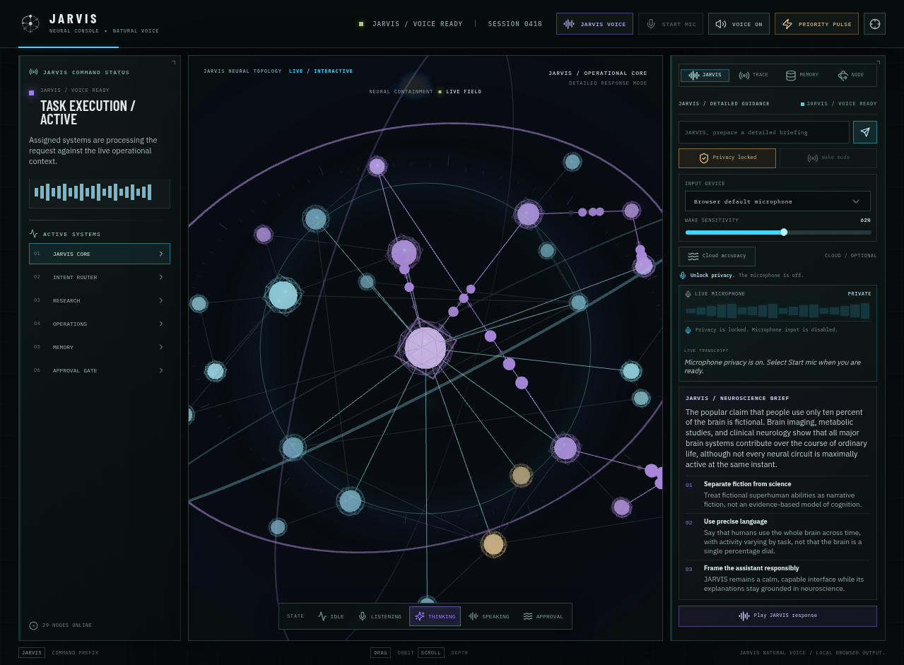

# JARVIS Neural Console

The **JARVIS Neural Console** is a full-stack React, TypeScript, Express, and tRPC operator interface for the JARVIS service. It pairs a selectable, orbitable 3D neural graph with safe high-level execution traces, visible answer timing, recoverable retry feedback, local two-minute conversational continuity, and concise browser-voice fallback.

<div align="center">
  
</div>

## Included behavior

| Feature | Implementation |
| --- | --- |
| Natural follow-ups | Retains the six most recent turns for a two-minute local window. |
| Privacy-aware interaction | Voice requires explicit browser microphone permission and supports a wake-word flow. |
| Honest delivery | Provider failures are shown as failures; the console never invents a local answer. |
| Safe trace | Shows transcript, routing, parsing, delivery, and approval state—never raw reasoning or secrets. |
| Voice handoff | Keeps the concise final response available for a Nitro 5 CosyVoice connector, with browser speech as fallback. |

## Development

```bash
pnpm install
pnpm check
pnpm test
pnpm dev
```

The console uses managed server-side environment variables for its model and future CosyVoice handoff. Do not add real service URLs, tunnel keys, or personal voice data to this repository.
